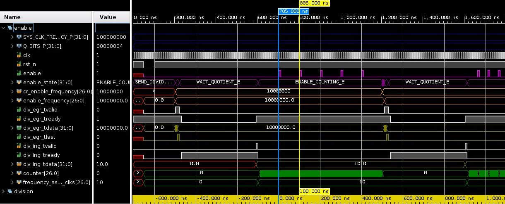

# rtl_common

Shared RTL primitives. Every core here is a **leaf**: it instantiates nothing
outside its own directory, so depending on this repository never drags in a
further dependency.

It exists to be a submodule. Modules that would otherwise each carry their own
copy of a RAM wrapper or a synchroniser take this instead, so there is one
implementation to fix and one to verify.

### Storage and clock crossing

| Core | Modules | What it is |
|------|---------|------------|
| `akerlund::memory_ram:1.0.0` | `ram_sp`, `ram_sp_bw`, `ram_sdp`, `ram_sdp2c`, `ram_sdp_bw`, `ram_tdp`, `ram_tdp_bw` | Synchronous RAM wrappers: single-port, simple dual-port (one and two clocks), true dual-port, each with a byte-write-enable variant |
| `akerlund::memory_reg:1.0.0` | `reg_sp_rf` | Single-port register file, for storage too small to be worth a RAM |
| `akerlund::cdc_bit_sync:1.0.0` | `cdc_bit_sync`, `cdc_bit_sync_core` | Multi-flop bit synchroniser for a single-bit clock-domain crossing |

`ram_sdp2c` is the two-clock simple-dual-port variant, which is what an
asynchronous FIFO needs; the rest are single-clock.

### Enable generators

Strobes rather than divided clocks: everything downstream stays in one clock
domain and is gated, so there is no second clock to constrain, no crossing to
synchronise, and nothing extra for a synthesiser to put on a clock tree.

| Core | Module | What it is |
|------|--------|------------|
| `akerlund::clock_enable:1.0.0` | `clock_enable` | One-cycle strobe every `cr_enable_period` **clocks** |
| `akerlund::clock_enable_scaler:1.0.0` | `clock_enable_scaler` | One-cycle strobe every `cr_enable_period` **input strobes** — chains behind another enable to reach a slower rate than one counter can express |
| `akerlund::delay_enable:1.0.0` | `delay_enable` | One-shot: `cr_delay_period` clocks after `start`, a single strobe. A `start` during a running delay is ignored, not queued |
| `akerlund::frequency_enable:1.0.0` | `frequency_enable` | Strobe at a frequency given in **hertz** rather than a period in clocks |

Every period is a register input rather than a parameter, so rates can change
at run time, and `reset_counter_n` restarts a counter — which is how several
enables are brought into phase.

**`frequency_enable` is not self-contained.** To turn hertz into a counter
value it needs `SYS_CLK_FREQUENCY_P / cr_enable_frequency`, and it has no
divider of its own: it drives an **external** long-division unit over AXI4-Stream
and waits for the quotient. With nothing answering on `div_ing_*` it waits
forever and never asserts `enable`. The other three have no such requirement.

## Use

Add it as a submodule and let FuseSoC find the cores:

```sh
git submodule add git@github.com:akerlund/rtl_common.git submodules/rtl_common
```

```yaml
# fusesoc.conf
[main]
cores_root = .
```

Then depend on the VLNV:

```yaml
filesets:
  rtl:
    depend:
      - "akerlund::memory_ram:1.0.0"
      - "akerlund::memory_reg:1.0.0"
```

FuseSoC matches a bare version **exactly**, so a depend on `akerlund::memory_ram:0`
is reported as a missing package rather than satisfied by `1.0.0`.

## Verification

The storage and crossing cores and the three counter-based enable generators
lint clean under Verilator and are exercised through their consumers.

`frequency_enable` is the exception and its README status has always said so:
it has only `frequency_enable/tb/tb_clock_enable.sv`, a bench with no
self-checking that configures one frequency, changes it, and leaves the
waveform as the result. It demonstrates the module rather than verifying it.



*A simulation of `frequency_enable`: the enable period is 100 ns at 10 MHz,
then 50 ns after the frequency is changed to 20 MHz.*

## Consumers

[`rtl_fifo`](https://github.com/akerlund/rtl_fifo) takes `memory_ram` and
`memory_reg`; [`rtl_afifo`](https://github.com/akerlund/rtl_afifo) reaches all
three through `rtl_fifo`.
